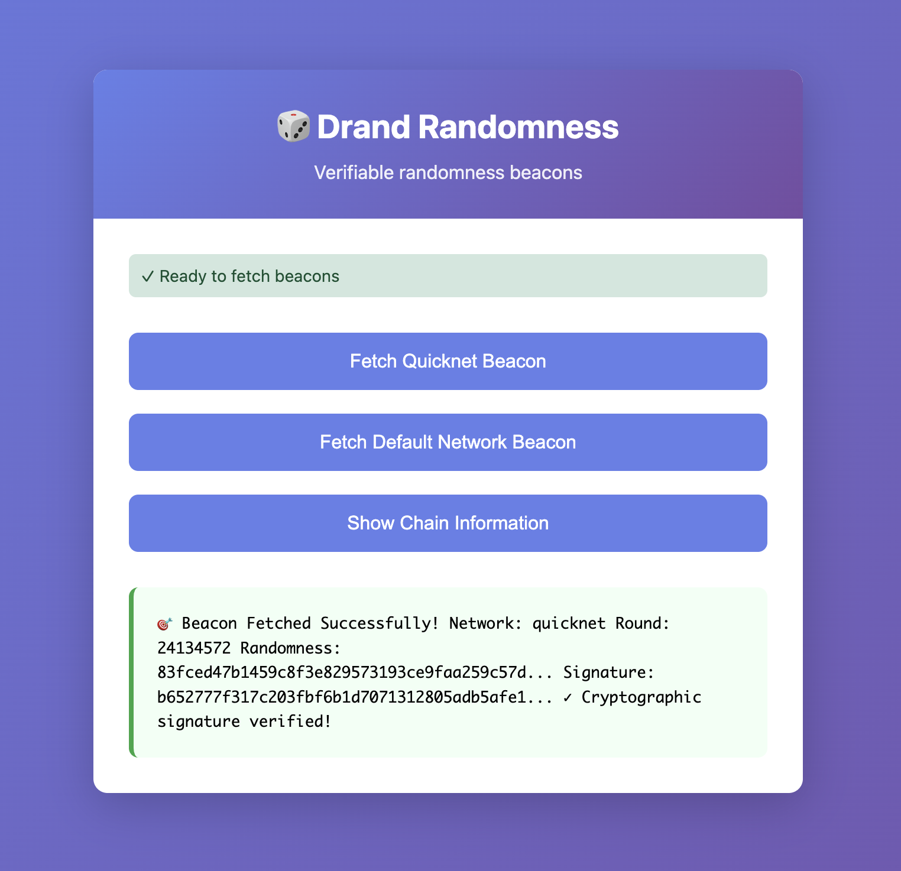

# Browser Example

Interactive demo showing cryptographically verified randomness in the browser.

**[🚀 Try the live demo](https://gimzou.github.io/drand-client-kotlin/)**

<p align="center">
  <a href="https://gimzou.github.io/drand-client-kotlin/">
    
  </a>
</p>

## Features

- ✅ Fetch latest beacons from quicknet (3s) and default (30s) networks
- ✅ Full BLS signature verification in-browser
- ✅ Chain information with automatic caching
- ✅ Clean error handling with user feedback

## Quick Start
```bash
# From project root
./gradlew jsBrowserProductionLibraryDistribution

# Serve with any static server
python3 -m http.server 8000

# Open http://localhost:8000/examples/browser/index.html
```

## How It Works

This example demonstrates real-world browser usage:

1. **Import map** resolves npm dependencies (`@noble/curves`, `@noble/hashes`) from CDN
2. **ES module** import loads the library
3. **Async/await** API fetches and verifies beacons
4. **Error boundaries** catch and display failures

The code you see here is **identical** to what npm consumers will use with bundlers like Vite or webpack.

## Code Highlights

### Fetch & Verify a Beacon
```javascript
import { Client } from 'drand-client';

const client = new Client();
const beacon = await client.getVerifiedLatestBeacon('quicknet');

console.log(`Round ${beacon.round}`);
console.log(`Randomness: ${beacon.randomness}`);
// Signature was cryptographically verified!
```

### Get Chain Info
```javascript
const info = await client.getChainInfo('quicknet');
console.log(`${info.beaconId}: ${info.period}s period, ${info.scheme}`);
```

### Handle Errors
```javascript
try {
    const beacon = await client.getVerifiedLatestBeacon('invalid-network');
} catch (error) {
    console.error('Verification failed:', error.message);
}
```

## Browser Compatibility

Requires modern browser with:
- ES modules support
- Import maps (Chrome 89+, Firefox 108+, Safari 16.4+)
- Async/await

For older browsers, use a bundler (Vite, webpack) which transpiles automatically.

## Next Steps

- View the [live demo](https://gimzou.github.io/drand-client-kotlin/)
- Check the [Node.js example](../nodejs/) for server-side usage
- Read about [drand networks](https://drand.love)